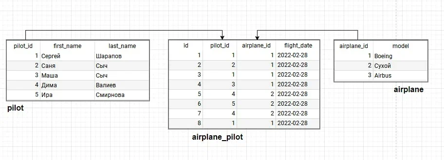

**Блок 1 - Логическая задача**

Сейчас час ночи. За окном идет снег. Насколько велика вероятность того, что через 72 час будет солнечная погода?

**Блок 2 - Linux**

1. Описать, что выведет данная команда в консоль Linux:

    ```bash
    grep -C 100 "2021-02-12" application.log
    ```

2. Описать различие команды tail и команды grep.
3. Возможно ли использовать команды из 2 вопроса вместе, если да, то как?

**Блок 3 - SQL-запрос**



В базе данных авиакомпании компании есть три таблицы.

Исходя из описания таблиц базы данных, составьте SQL-запрос, в котором

необходимо вывести Фамилию и количество полетов сделанных на самолетах модели “Cухой” с 01.02.22 по 28.02.22 числа .

Таблицы базы данных:

Таблица "pilot" содержит информацию о пилотах.

Поля таблицы:

* "pilot_id" – уникальный идентификатор пилота

* "first_name" – имя пилота

* "last_name" – фамилия пилота

Таблица "airplane" содержит информацию о моделях самолетов.

Поля таблицы:

* "airplane_id" – уникальный идентификатор самолета

* "model" – модель самолета

Таблица "airplane_pilot" содержит информацию о полетах.

Поля таблицы:

* "id" – уникальный идентификатор записи

* "pilot_id" – идентификатор пилота

* "airplane_id" – идентификатор самолета

* "flight_date" – дата полетов
