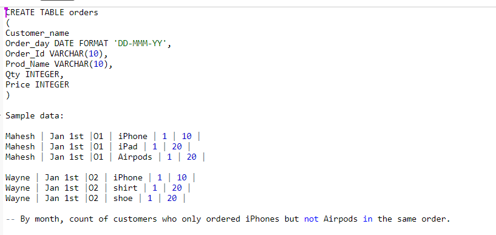
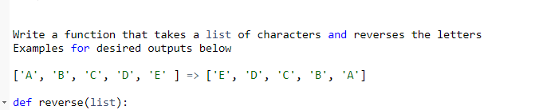

**Amazon SQL and Python Task**

Задача 1
========

Дана таблица Orders, Необходимо написать запрос для команды
маркетинга, который выявит всех киентов, кто купил iPhone, но не купил
Airpods, чтобы отправить им маркетинговое предложение.

Таблица и пример данных даны ниже:

Задача 2 
=========

Дана таблица с историей подписки. Есть начало и конече периода
подписки и статус. Нужно получить результат, как ~sample\ output~ .
Условие для типа подписки так же дано.

Amazon SQL and Python Task 1

**Задача 3**

Дан LIST, нужно его сохранить задам наперед. Так же возможно
предложить несколько вариантов и упомянуть про тип Big O notation,
сложности алгоритма.

Стоит упомянуть про использование памяти в зависимости от подхода.

Amazon SQL and Python Task 2 Amazon SQL and Python Task 3