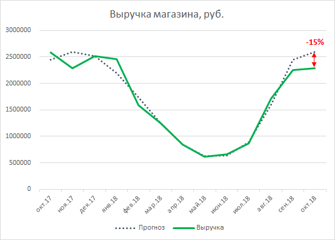

## Математический тест Авито

**Описание:** У вас есть 60 минут для прохождения теста из 5 заданий. Пользоваться разрешается только
ручкой/карандашом и бумагой. Целью является решение как можно большего количества задач.
**Рекомендация:** В начале прочтите внимательно все задачи и начните решать наиболее для вас простые.

**Task 1.**
Вы подбрасываете кубик (2N граней), после чего у вас есть две возможности:

1. Взять себе сумму $, равную выпавшему на кубике числу (выпало k – получаете k$)
2. Отклонить результат первого броска и подбросить кубик второй раз. После чего уже взять себе столько
   $, сколько выпало во второй раз (второй бросок отклонять уже нельзя)

Какую стратегию нужно выбрать, чтобы максимизировать ожидаемую прибыль (при каких значениях первого
броска нужно перебрасывать?)
Чему равна ожидаемая прибыль при этой стратегии (математическое ожидание)?

**Task 2.**
В каждом вопросе **есть** только **один** правильный ответ, при решении считать, что все запросы синтаксически
корректны.

1) В таблице revenue три колонки:
   event_date - дата
   user_id - уникальный id пользователя
   revenue - выручка, полученная от этого пользователя в этот день

Какую из колонок нужно добавить в этот запрос,

select event_date, user_id, revenue, <?>
from revenue
order by event_date desc, user_id

чтобы в ней на каждый день содержалась доля выручки пользователя в этот день от выручки того же
пользователя в предыдущий день?

Для каждой комбинации user_id, event_date есть только одно значение revenue, в данных нет Null-ов.

```text
a) revenue/lag(revenue) over(order by user_id, event_date),
b) revenue/lag(revenue) over(partition by user_id order by event_date),
c) revenue/lag(revenue) over(order by event_date),
d) revenue/lag(revenue) over(partition by user_id, event_date order by user_id, event_date)
```

2) select distinct a, b, c, sum(d) as revenue
   from table
   group by a, b, c

Сколько строк вернет данный запрос, если такой же запрос без «distinct» вернет 600 строк, а в столбце
revenue содержится 117 уникальных значений?
a) 483
b) 600
c) 117
d) 561

3) Какой запрос вернет самое большое число?

Для справки: ( **A** right join **B)** эквивалентно ( **B** left join **A)**.

```text
a) select count(distinct first.counter_column)
from first
left join second
on first.join_key = second.join_key
where second.filter_column >= 5
b) select count(distinct first.counter_column)
from first
left join second
on first.join_key = second.join_key
and second.filter_column >= 5
c) select count(distinct first.counter_column)
from first
right join second
on first.join_key = second.join_key
where second.filter_column >= 5
d) select count(distinct first.counter_column)
from first
right join second
on first.join_key = second.join_key
and second.filter_column >= 5
```

**Task 3.**
Перед вами шахматная доска размером NxN. В верхнем левом углу находится шашка. Шашка может
двигаться только вправо или вниз (вверх или влево двигаться не может). Сколькими различными путями
шашка может прийти в нижний правый угол?

**Task 4.**
Осьминог Пауль 1 6 раз пробовал угадать победителя футбольного матча. 14 раз он угадал правильно, 2
раза ошибся.
Проверьте гипотезу H0: Пауль выбирает победителя футбольного матча случайно.

### Сделайте вывод

### Task 5

Представьте, что вы аналитик в крупном интернет-магазине. За последний месяц факт продаж оказался на
15% ниже прогноза.



```text
1.Как определить, что это отклонение является аномальным и нужно искать его причину?
```

1. Как выяснить, в чем причина отклонения? Какие гипотезы вы бы стали проверять, как выбрали бы
   среди множества гипотез наиболее перспективные, какими методами их проверяли?
