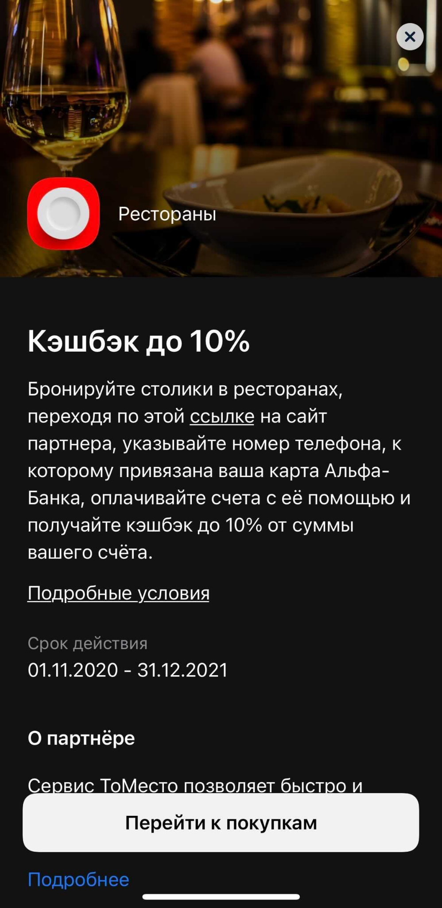

# Тестовое задание для продуктового аналитика мобильного и интернет-банка

## Задание 1 (SQL)

Приведите в качестве решения скриншот с результатом, скрипт (или ссылку на запрос
в среде, в которой решали задания, например <http://sqlfiddle.com/>), а также свои
комментарии относительно предложенного решения.

**SQL1**

Отобрать клиентов по г. Москва с суммарными остатками по клиенту от 20 000 на
последнюю дату.

```sql
create table #Клиенты (client_id varchar(1), FIO varchar (255) , Region varchar(50),
account_num int)
insert into #Клиенты values
('A','Иванов','Москва',111),
('A','Иванов','Москва',222),
('B','Петров','Иваново',333),
('C','Сидоров','Москва',444)

create table #Cчета (Date date, Summa_USD money, Account_num int)
insert into #Cчета values
('2012-01-01',15000,111),
('2012-02-01',10000,111),
('2012-02-01',5000,222),
('2012-03-01',30000,333),
('2012-04-01',20000,444)
```

## SQL2

Таблица #oper хранит информацию о количестве произведенных операций на каждую
календарную дату.
Вывести на каждую дату количества операций, совершенное с начала месяца по
указанную дату включительно накопительным итогом.

create table #oper (date date, cnt int)
insert into #oper values
('2019-06-02', 1985),
('2019-06-03', 1577),
('2019-06-04', 1597),
('2019-06-05', 1468),
('2019-07-06', 82),
('2019-07-08', 1689),
('2019-07-09', 1556),
('2019-07-10', 1480),
('2019-07-11', 1405),
('2019-07-12', 1502)

## SQL3

Даны месячные срезы сегментов клиентов, нужно получить по каждому клиенту
периоды действия каждого сегмента.

```sql
create table #segment (date date, ClientID varchar(6),SegmentID int)
insert into #segment values
('2018-01-31' ,'A11111', 2),
('2018-02-28' ,'A11111', 2),
('2018-03-31' ,'A11111', 1),
('2018-04-30' ,'A11111', 1),
('2017-11-30' ,'B22222', 1),
('2017-10-31' ,'B22222', 1),
('2017-09-30' ,'B22222', 3),
('2017-09-30' ,'C33333', 1),
('2017-10-31' ,'C33333', 1)
```

## Задание 2 (разметка и метрики)

Партнерская витрина - это набор предложений партнеров банка, которые
предоставляют различного рода скидки нашим клиентам.





На витрину можно перейти разными способами: через внешние и внутренние
коммуникации (SMS, email, push, баннеры/уведомления внутри приложения).
Партнеры могут предоставлять данные о совершенных нашими клиентами конверсиях
(транзакциях).

* Какие наборы метрик для оценки эффективности партнерской витрины вы
можете предложить?
* Опишите возможный набор систем и способы их интеграции, которые позволят
осуществлять трекинг полного пути пользователя и его конверсионных
действий.
* Какие сырые данные нужны и в каком виде для полноты картины?
* Какая разметка коммуникаций и действий пользователя вам понадобится для
отслеживания всего пути клиента?

## Задание 3 (когортный анализ)

Приведите в качестве решения скриншот с результатом, а также свои комментарии
относительно предложенного решения (с указанием среды, в которой решали
задания).
в приложенном файле хранятся данные об активности клиентов с сентября 2021 года
по февраль 2022
Необходимо на основе этих данных провести когортный анализ
Данные: [data_test.csv](https://raw.githubusercontent.com/Propsih/test/main/data_test.csv)
Описание полей:
CLIENT_ID - идентификатор клиента;
VALUE_DAY - отчетная дата;
DIGITAL_30_CNT - кол-во входов в мобильное приложение за последние 30 дней на
отчетную дату;
TRAN_ACTIVE_30_CNT - кол-во транзакций в мобильном приложении за последние 30
дней на отчетную дату;
OPER_ACTIVE_30_CNT - кол-во операций (транзакции+нефинансовые операции) в
мобильном приложении за последние 30 дней на отчетную дату

* постройте визуальное представление удержания клиентов в статусе:
    * активных клиентов банка (наличие строки для клиента на отчетную

    дату);
    * диджитал активных (активных в мобильном приложении: наличие хотя
    бы одного входа);
    * операционно активных;
    * транзакционно активных;
* какие выводы можно сделать на основе этих данных?;
* если построить проникновение транзакционно активных клиентов в когорты
диджитал активных клиентов, то мы увидим, что существенная часть клиентов
использует мобильное приложение, но не совершает транзакции (платежи и
переводы) в нем. Какие гипотезы такого поведения можно предположить? Как
их можно проверить ?;

* как можно исправить эту ситуацию и увеличить проникновение транзакционно
активных клиентов в диджитал активных?

## Задание 4 (портфолио)

Сделайте мини-портфолио по 2-3 сделанным вами ранее отчетам/исследованиям
(чувствительную информацию можете упустить, если прикладываете скрины отчетов -
“заблюрить” значения):

* какая цель и задачи стояли, какие пользователи результата,
* для исследований - какие методы и инструменты были выбраны,
* опишите источники данных, требовались ли доработки в источниках для
обеспечения полноты данных и для матчинга,
* какие инструменты использовались для выгрузки данных из источников и для их
объединения, для автоматизации,
* каким образом производился матчинг данных разных систем-источников,
* какие средства визуализации использовались и каким образом выглядел
конечный результат.
