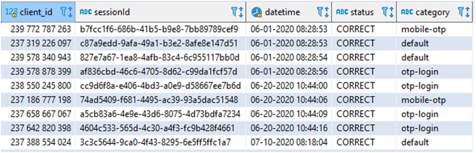

# Тестовое задание.

## Продуктовая часть.

**Задание 1.** Предложите 3 метрики первого уровня для мобильного и интернет-банка. Почему именно эти?

**Задание 2.** Вам необходимо понять какие цели отслеживаются на странице [https://www.open.ru/cards/opencard?from=main_menu](https://www.open.ru/cards/opencard?from=main_menu) .
    
    • Опишите, какие цели уже отслеживаются.
    • Опишите, каким образом вы поймете отслеживаются ли цели на странице.
    • Какие цели на ваш взгляд необходимо отследить.

**Задание 3.** Вы хотите повысить конверсию на странице https://www.open.ru/credit_cards/120days , для этого вы хотите провести А/Б тест. Опишите процесс проведения А/Б (подготовка, запуск, итоги). Приведите в пример гипотезы, на которые вы будете опираться при тестировании страниц.

**Задание 4.** Вам необходимо добавить отслеживание события перевода по номеру карты в мобильном и интернет-банке через web инструменты (выберете один из: GA, Amplitude, Я.Метрика, AppMetrica или другой на свой выбор)
    
    • Опишите, как вы видите процесс реализации задачи от постановки задачи (вам) до внедрения.
    • Опишите ТЗ для разработчика мобильного банка.
    • Опишите ТЗ для разработчика интернет-банка.

## SQL.

Дана таблица по вводу ОТП кодов клиентами.

**Задача:** решить максимальное количество заданий используя SQL.

Поля таблицы:
    • **client_id** -  номер клиента
    • **sessionId** – идентификатор сессии
    • **datetime** - дата время
    • **status** – статус ввода кода
    • **category** – текстовый код ОТП

**Задание 1.** Показать категорию, по которой было введено наибольшее число кодов

**Задание 2.** Добавить индикатор, который будет выделять следующие значения:
    • Если otp для категории платежей (payment), то - 1
    • Если otp для категории переводов (transfer), но не для переводов с использованием счетов (acc), то - 2

Все остальные заявки не должны попасть в результат выполнения запроса.

**Задание 3.** Посчитать метрику Month-of-Month (прирост текущего месяца к предыдущему) по уникальным клиентам с кодами otp-login.

**Задание 4.**  Одним запросом сформируйте:
    • Количество успешно введённых ОТП кодов в разрезе категории кода ОТП
    • Долю каждой категории по убыванию
    • Количество с накопительным итогом
    • Общее количество введённых ОТП кодов
    • Последний отчётный месяц (полный месяц, от текущего)

## *Python – дополнительно.

**Задание 5*.**

Представьте решение заданий 1-3 с помощью методов библиотеки pandas (исходный файл загрузите как датафрейм). Пришлите решение в виде файла Jupyter Notebook или ссылкой на Datalore.