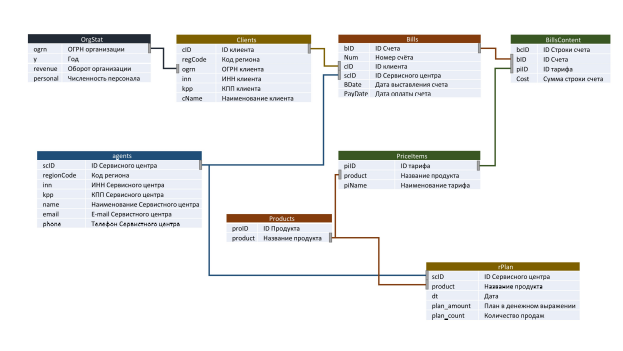

## ТЕСТОВОЕ ЗАДАНИЕ

Рядом с этим файлом лежит два бэкапа MS SQL и sqlite. Для решения тестового задания можно использовать любой. Структура данных и содержимое в них идентичны. Использовать можно любой.

**Схема данных:**

**Легенда:**
Индивидуальным предпринимателям (ИП) необходимо сдавать отчетность в контролирующие органы через веб-сервис
В 77 регионе есть несколько конкурирующих веб-сервисов (продуктов)
Соответствующий продукт Контура имеет название «Бухгалтерия.Контур»
Целевая аудитория веб-сервисов – ИП на упрощенной системе налогообложения (УСН)
Имеются данные о плане и факте продажах продуктов Контура в шт. и руб.
Имеются данные об ИП за ряд лет
Средняя цена продуктов на целевом рынке равна средней цене продукта Контура
Оплата веб-сервиса и у Контура, и у конкурентов происходит в зависимости от тарифа

**Задания:**
    1. План-факт анализ (анализ продаж)
а. Подготовить отчет о продажах продукта Контура в любом удобном формате с применением визуализации
б. Подготовить укрупненную и детализированные группы тарифов
в. Описать логику и последовательность выполнения задания
г. Сделать выводы и предположения, дать рекомендации по результатам отчета
    2. Прогноз продаж и оценка емкости и доли рынка
а. Спрогнозировать объем продаж продукта Контура на 2019 г.
б. Оценить емкость рынка и долю рынка Контура в 2015-2018 гг. и на 2019 г.
в. Описать логику и последовательность выполнения задания
г. Сделать выводы и предположения, дать рекомендации по результатам прогноза и оценки

Результаты можно представить либо в виде набора скриптов и книги Excel, либо в виде ноутбука Jupyter. Обратите внимание, чтобы в итогах был виден не только результат выполнения заданий, но и описана логика сбора данных.
