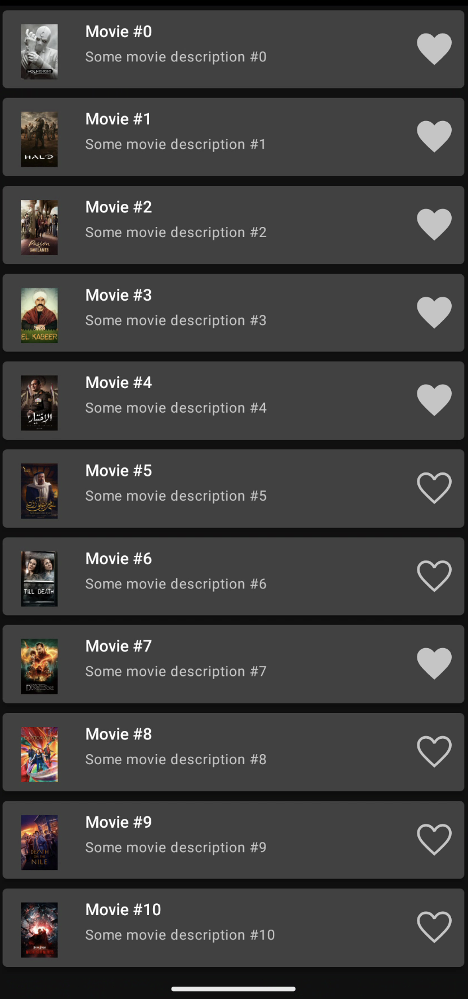
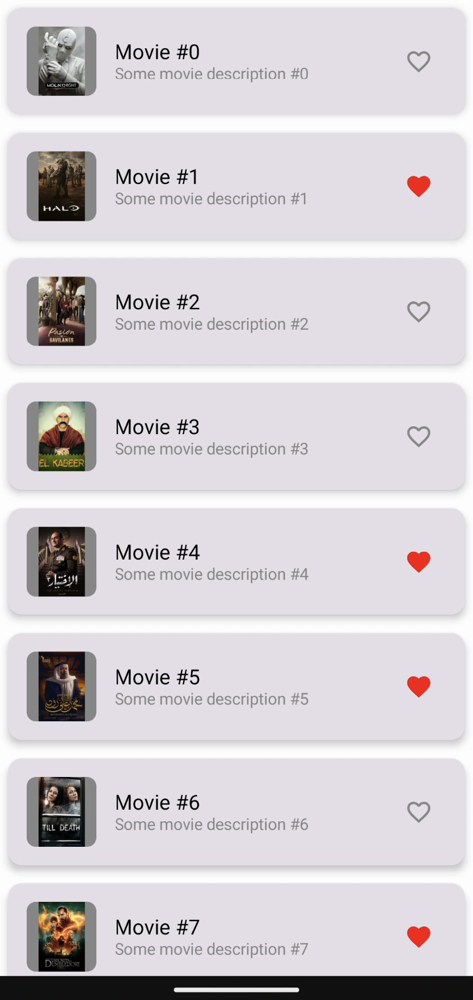

# BetterMe Android Test Task

> Локальная копия. Источник: <https://github.com/betterme-dev/AndroidTestTask>

## Movies client with offline-mode

Create the application which allows user to review the list of ongoing movies and add them to
bookmarks with the following requirements:

### Technical requirements

1. Provide proper logic for movies persistence (there are two sources: remote and local) and
   retrieval (you might be interested in `MoviesRepository`), cover this logic with unit tests.

2. There are pieces of code in this project which make some smell, some of them make this project
   not work properly. Even though, it's compiling.

3. Make sure, the movies list is displayed properly, and favorites functionality works fine as well.

4. Provide error handling where it's needed (wrap exceptions, provide error placeholders on the UI
   layer, etc).

5. Implement movie details screen / dialog / bottom sheet.

#### Notes

* There are two options of the UI layer implementation - Compose or XML.
  In case of Compose you should update `TaskConstants.TASK_VARIANCE` accordingly.
  There is no difference in requirements for both options - just choose whatever is more convenient
  for you.
* Just imagine `MoviesRestStore` is a component which interacts with the real Movies database API
  (even though it's not :D).
* You can change any code in this project as you wish

#### Sample of the UI (XML)

#### Sample of the UI (Compose)

