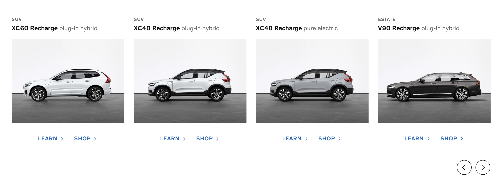
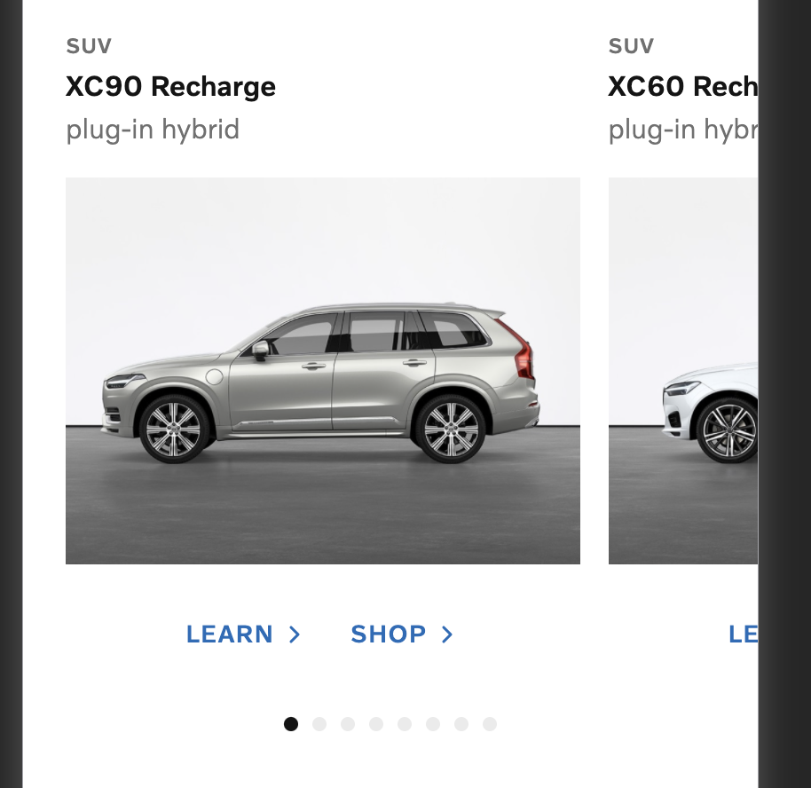

# Volvo Cars (Global Online Digital)

> Локальная копия. Источник: <https://github.com/volvo-cars/god-frontend-code-test>

## Front-end coding test (React)

Our team's designer has come up with a new design to show our latest and greatest recharge cars on the website.

Here is how the design look like for desktop and mobile (files are stored under `docs` folder)

### Desktop



### Mobile



The data required to render the design is under `public/api/cars.json` folder. You need to fetch the data and render it in the browser. The data looks like this:

```json
[
  {
    "id": "xc90-recharge",
    "modelName": "XC90 Recharge",
    "bodyType": "suv",
    "modelType": "plug-in hybrid",
    "imageUrl": "/images/xc90_recharge.jpg"
  }
]
```

The product owner is telling you that you can generate the links to the learn and shop pages of each car by concatating the `id` of the car to the learn (`/learn/`) and shop (`/shop/`) urls.

Two extra SVG icons are also provided by our designer which are stored under `docs` folder.

## Requirements

* The project is bootstraped using [Next.js](https://nextjs.org/).
* Browser support is modern ever-green browsers.
* Implement this design using React and Typescript.
* Accessibility is important.
* Code Structure and reusablity is important.

## Bonus Points

* If you use our design system component library, [VCC-UI](https://vcc-ui.vercel.app/)
* If you add a filter bar on the top to filter cars by `bodyType`

## Submission

Clone this repository to get started. Due to a number of reasons, not least privacy, you will be asked to zip your solution and mail it in, instead of submitting a pull-request. In order to maintain an unbiased reviewing process, please ensure to keep your name or other Personal Identifiable Information (PII) from the code.
