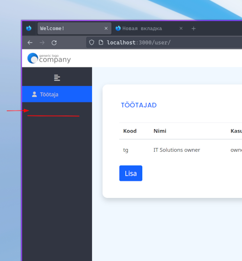

> Локальная копия. Источник: <https://github.com/itsolgrp/tests-tasks>

## Тестовое задание для Backend/Fullstack Developer

---

Основной твоей обязанностью будет разработка web приложений для наших партнеров.
Необходимо выполнить задание и залить готовый результат на Github
Выполнение всех пунктов задания обязательно, но если что-то не получается, то не стоит тратить на это много времени. В таком случае просто опиши, что и почему не получилось сделать.

##

## Задание

---

* Запустить проект из архива `app.zip` в среде разработки и убедиться, что он работает с дампом базы (копию базы данных взять из дампа `dump.sql`)
* Реализовать функционал по описанию ниже
* Написать инструкцию по запуску проекта
* Если возможно, то выложить проект на хостинг и прислать ссылку (можно на любой бесплатный хостинг)

Необходимо реализовать страницу с таблицей и элементами редактирования, создания и удаления записей.  
Допустимо использование готовых воспомогательных библиотек (например jQuery, Bootstrap и т.д.).  
Готовое решение должно быть максимально простым и понятным, с минимальным количеством кода.  
Оценочное время выполнения задания 6-8 часов.



**Маршрут /mapping/ (GET)**

На странице должна быть таблица с выводом из таблицы profit_category_map полей ```id,recipient,options is null``` Должны присутствовать элементы редактирования


**Cоздание**

* Вешаем кнопку + над таблицей справа
* Должно открываться модальное окно
* В модальном окне должны быть поле input обязательное Отправитель и select с выбором категории из таблицы profit_category
* Должен уходить Ajax /mapping/new (POST) в json c recipient,category_id
* Также должна быть валидация инпута (не пустой и не больше разрешенной длинны)

**Редактирование**

* Должно открываться модальное окно
* В модальном окне должны быть поле input обязательное Отправитель и select с выбором категории из таблицы profit_category
* Должен уходить Ajax /mapping/edit (POST) в json c recipient,category_id
* Также должна быть валидация инпута (не пустой и не больше разрешенной длинны)

**Удаление**

* Должно открываться модальное окно
* Должен быть вопрос "Вы точно хотите удалить отправителя?"
* На маршрут должен уходить Ajax /mapping/delete (DELETE) в json c id

Удачи! Если будут какие-то вопросы, пиши – добавим уточнения в репу.
