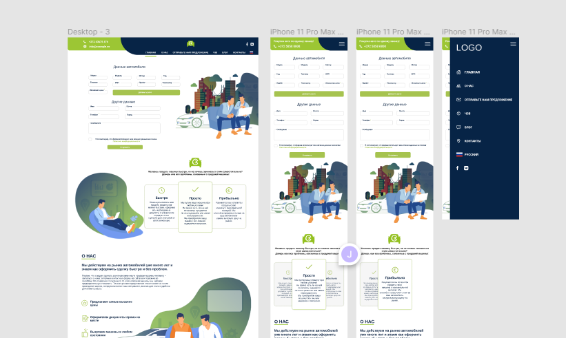

> Локальная копия. Источник: <https://github.com/itsolgrp/tests-tasks>

## Тестовое задание для Frontend Developer

---

Основной твоей обязанностью будет разработка web приложений для наших партнеров.
Необходимо подготовить верстку на основе макета и залить готовый результат на Github

## Условия

* Работоспособность в актуальной версии Google Chrome
* Использование актуальной версии [Tailwind CSS](https://tailwindcss.com/)
* Результат необходимо залить на Git для проверки
* Остальное на твоё усмотрение (использование VueJS или ReactJS будет плюсом)

## Макет (Figma)

<https://www.figma.com/file/rLV6MVF2wsyC3eSCneItzb/CarBuy?node-id=0%3A1>

Figma

Удачи! Если будут какие-то вопросы, пиши – добавим уточнения в репу.
