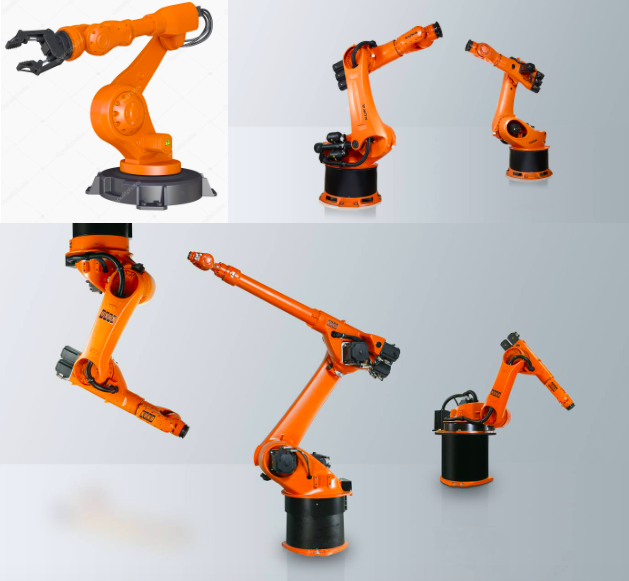

# 3d-artist-test-2018

> Локальная копия. Источник: <https://github.com/phygitalism/3d-artist-test-2018>
Тестовое задание для 3D Artist

## Описание

Суть задания заключается в визуализации технического объекта и процесса происходящего с ним.
Обязателен к исполнению только базовый уровень и работа с ней в Unity. Остальные задания проработать по мере возможности. Но чем больше, тем лучше конечно же.

## Референс

## Базовый уровень

Смоделировать роборуку компании Kuka. На референсах различные версии данной техники. Легенда: данная роборука находится возле конвейера по производству автомобилей. При желании, можно воссоздать какой либо манипулятор-насадку на ваш вкус, или вовсе оставить без него.
Модель может быть как low-poly с high-poly, так и middle-poly. Но общий полигонаж middle-poly не должен превышать 15000 полигонов. Сама модель может быть как максимально приближина к референсу, так и быть более простой. Основное требование, это узнаваемость конструкции.
Текстуры в Substance Painter. Цветовую гамму требуется разнообразить до 2-3х цветов от исходного изображения. (Для примера: разнести в 2 цвета - арматуру и сами объекты)

## Средний уровень

Если вы умеете работать с ригом, то постараться создать простой риг модели в вашем 3D пакете.
Легенда: Роборука сваривает/крепит отдельную часть от машины к каркасу машины. (Создавать машину или деталь машины не обязательно. Роборука может работать с воздухом)

## Продвинутый уровень

Как минимум визуализировать полученный результат в любом, на ваш вкус, инструменте. (Marmoset, substance painter, corona renderer и т.д.)
Импортировать модель в Unity3D, настроить материалы и создать prefab модели.
По возможности, либо импортировать анимацию из 3D пакета в Unity, либо анимировать скелет вручную используя animator или timeline инструмент в Unity.

## Дополнительное задание

Исходя из начального задания, нужно иметь ввиду, что на предприятие, на котором находится роборука, происходит кибератака. Подумать, как возможно визуализировать такую атаку на механизм роборуки, чтобы остановить конвейер.
Исполнение возможно как с помощью иллюстраций, так и полностью визуализация будь то в 3D пакете, либо Unity.
Атака не явная, но влечет за собой большие потери.

## Ограничения и допущения

В файле на отправку должен быть проект Unity3d либо package, с импортированной моделью, перед этим, в сцену. Модель в формате FBX c визуализацией.
3D-редактор можно использовать любой.
При выполнении базового уровня важно на выходе получить как можно меньше отдельных материалов. По возможности текстуры создать под один текстурный атлас.
При выполнении второго уровня приветствуется исполнение под Unity3D, но возможен вариант рендера в любом пакете моделирования.
Выполнение третьего уровня проводить в Unity3D, приветствуется использование различных методов настройки шейдера, не только стандартный. К примеру, вы можете настроить материалы под HDRP, но не обязательно.
