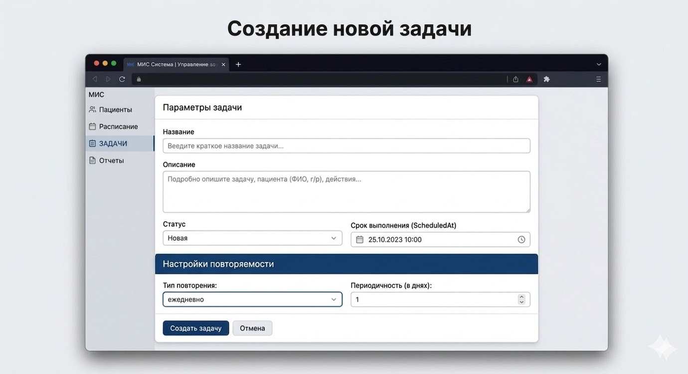

# Тестовое задание для junior+ ruby on rails разработчика
## **1. Описание задачи**

**Суть задачи:** разработать API модуля трекера задач.

**Описание предметной области:** мы разрабатываем медицинскую информационную систему (МИС), включающую в себя несколько модулей. Один из них — трекер рабочих задач для персонала. Через этот модуль врачи и администраторы могут ставить себе рабочие задачи: провести операцию, связаться с клиентом, сделать обход пациентов, подготовить отчет и так далее.

### **1.1 Что нужно сделать?**

**Шаг 1. Реализовать базовый CRUD задач**

Вам необходимо самостоятельно инициализировать приложение (Ruby on Rails API) и реализовать базовые возможности трекера задач: создание, редактирование, удаление и просмотр задач (получение задачи по ID и получение списка задач, с фильтрацией по дате и статусам).

Задача должна иметь как минимум название, описание и дату (имеется ввиду дата выполнения) и статус.

**Шаг 2. Добавить теги для задач**

Необходима возможность добавлять и удалять теги для задач. У одной задачи может быть много тегов и один тег может быть добавлен множеству задач.

Теги: “отчетность”, “операции” и “звонок” должны присутствовать в системе в обязательном порядке. Их удаление и изменение должно быть под запретом.

**Шаг 3. Добавить настройки периодичности (параметры повтора)**

Многие задачи для персонала — периодические. Кому-то необходимо выполнять ежедневный обзвон пациентов, кто-то по чётным дням занимается формированием отчетности, а кто-то проводит еженедельные инвентаризации.

Необходимо дать возможность пользователю определять периодичность задачи и сделать так, чтобы задачи в трекере создавались (или отображались) с учетом этих настроек.

Типы задач по периодичности, которые нужно поддержать:

- ежедневные (каждый n-й день);

- ежемесячные — задачи на каждое определенное число месяца (от 1 до 31);

- на конкретные даты — задачи создаются только на указанные даты;

- четные/нечетные дни месяца — задачи планируются либо только на четные числа, либо только на нечетные.

### **1.2 Реализация логики повторяемости задач**

Есть множество способов реализовать логику создания повторяющихся задач. Вы можете выбрать любой вариант, но при проверке решения тестового мы обратим внимание на такие, критичные для нас, моменты:

1. **Проблема бесконечности**

Если пользователь создает задачу «ежедневный обход» без даты окончания, она будет повторяться бесконечно. Создавать в базе данных миллионы записей на 100 лет вперед - плохая идея. Вам нужно придумать способ, как хранить и как отдавать список задач для запрошенного временного окна.

2. **Состояние конкретного экземпляра**

Врач может отметить задачу как «выполненную» за сегодня, но это не должно помечать выполненными вчерашние или завтрашние повторения. У каждого "экземпляра" (выпадения) периодической задачи в определенный день должно быть свое независимое состояние (status).

3. **Исключения из правил** _(бонусная задача - опциональная)_

Что если врач перенес «ежедневный обход» конкретно в эту среду на 2 часа позже, или отменил его только на сегодня? Подумайте, как можно было бы реализовать "отрыв" одного экземпляра от общего правила периодичности.

### **1.3 Визуальное описание результата**

Концептуальное (примерное) изображение такс-менеджера, API которого необходимо реализовать

### **1.4 Стек технологий**

- **Ruby:** 3.4.x (или выше)

- **PostgreSQL:** 16+

Плюсом будет упаковка приложения в Docker (docker-compose) для быстрого запуска.

## **2. Результат**

В качестве результата пришлите ссылку на репозиторий с выполненным тестовым заданием.

В репозитории обязательно должны присутствовать:

- инструкция по локальному запуску проекта,

- swagger документация,

- импорт чата с LLM в виде HISTORY.md файла.

**Комментарии к заданию**

В этом задании мы намеренно не детализируем все требования до уровня пошагового ТЗ. Нам важно увидеть, как вы самостоятельно спроектируете решение: какие сценарии учтёте, какую структуру базы данных выберете для "календарной" логики, какие ограничения заложите и как обоснуете свои решения.

Вы можете и должны делать разумные предположения там, где требования не определены явно. Такие предположения нужно коротко описать в README.md.

Мы будем обращать внимание на:

- на качество и чистоту спроектированного API,

- на глубину проработки бизнес-сценариев связанных с работой с задачами (работа с серией задач, работа с одиночной задачей и т.д.),

- на организацию кода и следование лучшим практикам из мира Ruby on Rails.

> ℹ️ **Мы поощряем использование LLM в разработке**
>
> Вы можете использовать абсолютно любые инструменты для выполнения задания, в том числе и LLM (главное — не забудьте приложить историю запросов).

Желаем вам успехов в выполнении тестового задания ❤️
